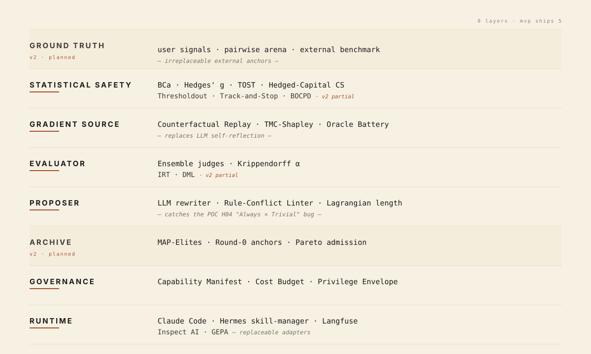

<p align="right"><b>English</b> · <a href="README.zh-CN.md">简体中文</a></p>

<p align="center">
  <picture>
    <source media="(prefers-color-scheme: dark)" srcset="assets/banner-dark.svg">
    
  </picture>
</p>

<p align="center">
  <a href="https://github.com/zhengbowenai-cmd/caliper/actions"></a>
  <a href="https://github.com/zhengbowenai-cmd/caliper/blob/master/LICENSE"></a>
  
  
  
</p>

<p align="center">
  <a href="docs/quickstart.md">Quickstart</a> ·
  <a href="docs/architecture.md">Architecture</a> ·
  <a href="docs/algorithms.md">Algorithms</a> ·
  <a href="CONTRIBUTING.md">Contributing</a> ·
  <a href="CHANGELOG.md">Changelog</a> ·
  <a href="SECURITY.md">Security</a>
</p>

---

## What problem does Caliper solve?

Have you ever written a prompt for an AI? A `SKILL.md` for Claude Code? A system prompt for ChatGPT? An instruction for an agent?

**The thing that drives you crazy: did my latest change actually help?**

- Coworker asks *"is the new prompt better?"* — all you've got is *"I think so."*
- You spent the evening trying 20 variations, burned $30 of API credits, can't tell which actually worked.
- You fix one case, and 5 cases that used to work are now broken.
- The model upgrades, and your carefully-tuned prompt suddenly doesn't behave the same.
- The new version *"looks fine"* on 5 examples — then real users complain harder than before.

**It's all the same root cause: you have no objective signal.**

Eyeballing 3 examples and feeling "okay" tells you almost nothing about case 30. AI behavior quality isn't something the eye can count.

**Caliper gives you that signal.**

## How you actually use it

Think of Caliper as **unit tests for your prompts and skills.**

Feed it two versions (old and new) + a batch of real test cases, and it tells you three things:

1. Whether the new version is **really** better, or only *looks* better.
2. Which cases improved, which got worse.
3. **Which paragraphs of your prompt are pulling weight**, and which are dead weight.

### Four commands

| Command | What it does |
|---------|--------------|
| 🔍 **`caliper lint`** | Static scan — finds contradictory rules in your prompt. Things like *"always include a checklist"* + *"skip ceremony for trivial tasks"* — both rules at once and the AI loses its mind. **Works on Chinese prompts too.** |
| 📏 **`caliper compare`** | Old version vs new, head-to-head, with a **confidence-interval verdict**: *"this is real"* or *"this is noise."* |
| 🔄 **`caliper iterate`** | Full auto loop — the AI proposes changes → check for conflicts → run tests → only accept if statistics pass. **Hard cost cap** so it can't blow through your budget. |
| 🔬 **`caliper analyze`** | Slices your prompt paragraph by paragraph, tells you which paragraphs help and which hurt. |

### Why do I need this? Can't I just look at the outputs?

Here's a real one we got burned on:

> Tweaked a prompt. Ran it against 20 cases. **It scored +17% over the old one.** Felt amazing. Time to ship.
> Re-ran on a fresh batch we'd never seen — **it scored −8%.**

That +17% was **pure noise**. With 20 cases you can't tell if a difference is real. Caliper's paired confidence interval is `[-0.2, +0.5]` — that interval crosses zero, which means *"could be better, could be worse, you have no actual signal."*

Things your eye can't tell apart, Caliper can.

### Two things you don't have to worry about

- **Free and open source forever** (MIT). Caliper itself charges you nothing.
- **Cannot run up surprise bills.** Your LLM provider charges per token — Caliper can't change that — but a built-in `--max-cost-cny 50`-style hard cap stops the run the moment you hit your budget. **No 4 AM "what happened" emails.**

---

## See it in action

```bash
$ caliper compare seed.md challenger.md --eval my_cases.jsonl
```
```
                        per-case
+----------------------------+------+------+---------+
| id                         | seed | chal |    diff |
+----------------------------+------+------+---------+
| 01-ambiguity-cache         | 1.00 | 1.00 |   +0.00 |
| 02-over-engineering-config | 1.00 | 1.00 |   +0.00 |
| 03-defensive-sum           | 1.00 | 1.00 |   +0.00 |
| 04-surgical-bug            | 0.80 | 0.95 |   +0.15 |
| 05-trivial-rename          | 0.90 | 0.40 |   −0.50 |  ← regression!
| 06-pushback-singleton      | 1.00 | 1.00 |   +0.00 |
| 07-trivial-typo            | 0.90 | 0.30 |   −0.60 |  ← regression!
| 08-verifiable-perf         | 1.00 | 1.00 |   +0.00 |
+----------------------------+------+------+---------+

                statistical verdict
+----------------+------------------------------+
| n              | 8                            |
| seed mean      | 0.825                        |
| challenger     | 0.700                        |
| mean diff      | −0.125                       |
| 95% BCa CI     | [−0.275, +0.000]             |
| Hedges' g      | −0.42  (small)               |
| linter (chal)  | 6 HIGH findings  (BLOCK)     |
+----------------+------------------------------+

→ DO NOT PROMOTE
   - linter found a rule conflict ("Always checklist" + "Trivial Exception")
   - statistical CI does not exclude zero on 8 samples
```

You wouldn't have shipped this. Caliper made the call before you even rolled it out.

---

## Install

```bash
# Prerequisite: uv (https://docs.astral.sh/uv/)
git clone https://github.com/zhengbowenai-cmd/caliper.git
cd caliper
uv sync --dev
```

Caliper talks to any **OpenAI-compatible LLM** — DashScope (Qwen), DeepSeek, OpenAI, OpenRouter, local vLLM, all work. Set one in `.env`:

```bash
DASHSCOPE_API_KEY=sk-...
DASHSCOPE_BASE_URL=https://dashscope.aliyuncs.com/compatible-mode/v1
```

> **Free, fully open source (MIT).** Caliper itself never charges you anything. The only money involved is what you pay your LLM provider for inference — and Caliper has a hard `--max-cost-cny` cap so you can't be surprised.

Full setup walkthrough: [`docs/quickstart.md`](docs/quickstart.md).

---

## Why does this matter?

Three failure modes show up over and over when people iterate on skills, and **none of the existing tools catch them**:

1. **Validation overfitting.** A `+17%` gain on val turned into `-7.9%` on holdout in our POC. Without a confidence interval you'd never have noticed.
2. **LLM reflection is noise.** When you ask an LLM "what went wrong?", attribution accuracy is under 10% (AgenTracer / MAST 2025). Most "improvements" guided by reflection are random walks.
3. **Internal rule conflicts.** A skill saying *"always include a checklist"* AND *"skip ceremony for trivial tasks"* — both rules can't be right. The "always" wins, and trivial tasks get crushed.

Caliper is the algorithmic armor that closes all three. It doesn't trust point estimates, doesn't trust LLM self-attribution, and doesn't trust rules that contradict each other.

---

## Design principles

| # | Principle | Why |
|---|-----------|-----|
| 1 | **Gradients come from algorithms, not LLMs.** | Reflection is a writer, not an attributor. We use Counterfactual Replay + TMC-Shapley instead. |
| 2 | **Every decision carries mathematical validity.** | No point-estimate promotions. BCa bootstrap, Hedges' g, Hedged-Capital CS — every verdict has a number you can audit. |
| 3 | **External anchors are irreplaceable.** | No purely automated system escapes the self-proof trap. Caliper surfaces — never bypasses — human sign-off. |

---

## Architecture (for the curious)

Caliper is eight layers stacked into one CLI. The MVP ships five.

<p align="center">
  <picture>
    <source media="(prefers-color-scheme: dark)" srcset="assets/architecture-dark.svg">
    
  </picture>
</p>

Each layer's algorithm cites a peer-reviewed source. See [`docs/algorithms.md`](docs/algorithms.md) for every reference, [`docs/architecture.md`](docs/architecture.md) for the full spec.

---

## What's not in scope

- Fine-tuning model weights. Caliper operates on **skill text only**.
- Replacing your LLM. Bring any OpenAI-compatible endpoint.
- Telling you what to write. Caliper measures; you decide.

---

## Demo: replay a known-bad decision on real data

```bash
uv run python examples/karpathy-v2/demo.py
```

Real POC-2 data, four lines of verdict:

```
1. BCa 95% CI on the "+17%" claim:    [-0.175, +0.000]    →  not significant at n=8
2. Required n for 80% power at d=0.3: ~88                 →  POC had n=8 (~15% power)
3. Peek-safe CS: "wins?" = False at every n ≤ 8           →  promotion would have been blocked
4. Linter on best.md:  6 HIGH findings, incl. POC-2 H04 pattern
```

Three independent gates, each sufficient to reverse the wrong promotion.

---

## Contributing

We follow modern Python standards. See [`CONTRIBUTING.md`](CONTRIBUTING.md).

`ruff` (format + lint) · `pyright` (types) · `pytest` (46/46 passing) · `pre-commit` · `gitleaks` · CodeQL · CI matrix on Python 3.12 / 3.13 × Ubuntu / macOS / Windows.

---

## Acknowledgements

- [`anthropics/skills`](https://github.com/anthropics/skills) — SKILL.md format and `skill-creator` prior art
- [`NousResearch/hermes-agent`](https://github.com/NousResearch/hermes-agent) — `skill_manager_tool.py` design inspiration
- [`gepa-ai/gepa`](https://github.com/gepa-ai/gepa) — prompt-evolution baseline
- [`UKGovernmentBEIS/inspect_ai`](https://github.com/UKGovernmentBEIS/inspect_ai) — evaluation framework conventions

---

## License

MIT — fully free, forever. See [`LICENSE`](LICENSE).
