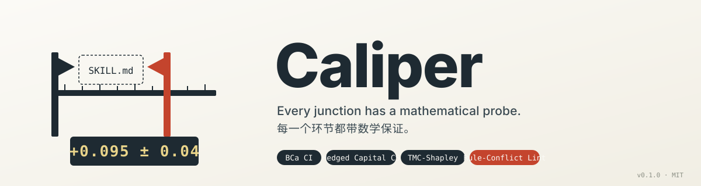
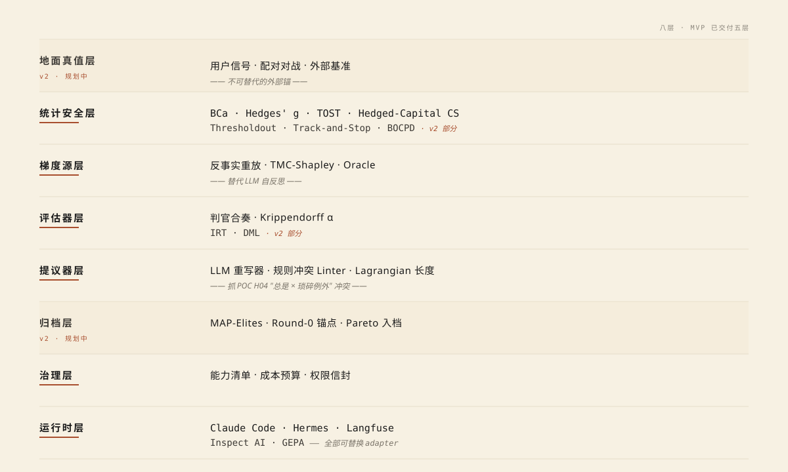

<p align="right"><a href="README.md">English</a> · <b>简体中文</b></p>

<p align="center">
  <picture>
    <source media="(prefers-color-scheme: dark)" srcset="assets/banner-dark.svg">
    
  </picture>
</p>

<p align="center">
  <a href="https://github.com/zhengbowenai-cmd/caliper/actions"></a>
  <a href="https://github.com/zhengbowenai-cmd/caliper/blob/master/LICENSE"></a>
  
  
  
</p>

<p align="center">
  <a href="docs/quickstart.zh-CN.md">快速上手</a> ·
  <a href="docs/architecture.zh-CN.md">架构</a> ·
  <a href="docs/algorithms.zh-CN.md">算法</a> ·
  <a href="CONTRIBUTING.zh-CN.md">贡献</a> ·
  <a href="CHANGELOG.md">更新日志</a> ·
  <a href="SECURITY.zh-CN.md">安全</a>
</p>

---

**Caliper 是 AI prompt 的统计实验台。** 它用配对 BCa 自助置信区间 + 段级 Shapley 归因 + 规则冲突 lint，回答一个问题：**新版 prompt 真的好过旧版，还是只是看着好。** 不是又一个 prompt 优化框架，不是给 LLM 套壳的中间件——它是一把测量仪器。

接任意 OpenAI 兼容 endpoint —— Qwen / DeepSeek / OpenAI / OpenRouter / 本地 vLLM。**永久免费、MIT、绝不收费**。

<table>
<tr><td><b>知道 v2 是不是真比 v1 好</b></td><td>配对 BCa 自助置信区间 + Hedges' g + 等价检验。告诉你 "+17%" 是真改进还是噪声。</td></tr>
<tr><td><b>抓出 prompt 自相矛盾</b></td><td>静态 lint 发现"永远要带清单"+"琐碎任务跳过仪式"这种 AI 自己常写出的隐藏冲突。中英文都支持。</td></tr>
<tr><td><b>段级解剖，不靠肉眼</b></td><td>反事实消融 + TMC-Shapley。指出 prompt 里**哪一段在拉分、哪一段在扣分**。</td></tr>
<tr><td><b>自动迭代不烧钱</b></td><td>AI 提议 → lint → 跑测试 → 统计通过才接受的全自动循环。带 <code>--max-cost-cny</code> 硬闸，<b>绝不会有意外账单</b>。</td></tr>
<tr><td><b>接你已有的一切</b></td><td>OpenAI 兼容 endpoint 全支持。Adapter 接口可换 Hermes / GEPA / Inspect AI / Langfuse。无供应商锁定。</td></tr>
<tr><td><b>透明、可审计、可复现</b></td><td>每个判决都落 JSON：BCa CI、Hedges g、CS 区间、linter 发现、判官投票。jq / DuckDB 直接查。</td></tr>
</table>

> **真栽过的坑**：调一版 prompt 跑 20 道题，**算出来 +17%**，准备上线。
> 换一组没见过的题重跑，**−8%**。那 17% 全是噪声——Caliper 的配对置信区间一算
> `[-0.2, +0.5]`，区间跨 0，意思是"统计上没区别"。**肉眼分不清的事，Caliper 算得清。**

## 在你的 Agent 里直接用 Caliper

不想记 4 个 CLI 命令、不想手写 JSONL、不想读 JSON 判决文件？把 Caliper 装成你 agent 的一个 skill，**直接用大白话和 agent 说话就行**——agent 替你跑 Caliper、读结果、用人话告诉你结论。

### 装完之后是什么感觉

你直接对你正在用的 agent（Claude Code / Hermes / Cursor / 任意支持 SKILL.md 的）说：

> *"我刚改了那个 review skill，新版真的比旧版好吗？"*

Agent 立刻反应：
- 听到"真的比旧版好吗"这种触发词
- 自动调 `caliper compare 老.md 新.md`
- 跑测试 + 算配对置信区间
- 用人话告诉你结果

不用记命令、不用手动操作、不用读 JSON。

### 三个真实使用场景

| 你对 agent 说 | Agent 用 Caliper 替你做的事 |
|--------------|--------------------------|
| **"我改了 review skill，新版更好吗？"** | 调 `caliper compare 老.md 新.md`，告诉你 BCa 置信区间。是真改进就建议上线，是噪声就劝你别上 |
| **"这个 prompt 太长了，能砍哪段？"** | 调 `caliper analyze`，找出 Shapley 贡献接近 0 或负的段落，建议你删除或改写 |
| **"为啥 AI 老在简单任务里加验证清单？"** | 调 `caliper lint`，发现"永远要带清单"+"琐碎任务跳过"两条规则在打架，告诉你冲突在 prompt 哪一行 |
| **"自动改进这个 prompt，但别花超过 ¥50"** | 调 `caliper iterate --max-cost-cny 50 --rounds 3`，跑完把最终冠军和判决理由报给你 |

### 30 秒装好（Claude Code 示例）

```bash
# 1) 装 caliper 本体
uv tool install caliper

# 2) 配 LLM key（Caliper 跑评估需要）
export DASHSCOPE_API_KEY=sk-...     # 或 DEEPSEEK / OPENAI

# 3) 装 skill
mkdir -p ~/.claude/skills/caliper
curl -L https://raw.githubusercontent.com/zhengbowenai-cmd/caliper/master/skills/caliper/SKILL.md \
    > ~/.claude/skills/caliper/SKILL.md

# 4) 重启 Claude Code（或 /reload）
```

完事。打开 Claude Code 直接说话：

```
你：    我刚改完了 ~/.claude/skills/qa/SKILL.md，旧版备份在 ./qa-old.md。
        新版真的更好吗？
Claude： （识别到触发词，自动调 caliper）
        > 让我用 caliper 比一下。我先帮你写 8 条 QA 测试用例...
        > 跑完了。
        > 
        > 结果：
        >   旧版均值 0.73，新版均值 0.78（看似 +6.8%）
        >   BCa 95% 置信区间 [-0.04, +0.14]
        >   Hedges' g = +0.21（small）
        > 
        > 区间跨过 0 —— 统计上看，**这次改动可能是真的好一点点，
        > 也可能就是测试用例的随机波动**。
        > 建议：要么扩到 20+ 条测试用例再测，要么这次先不上，
        > 因为效应量太小不值得引入风险。
```

### 各 agent / IDE 兼容情况

| Agent / IDE | 安装方法 | 状态 |
|-------------|---------|------|
| **Claude Code** | 拷到 `~/.claude/skills/caliper/` | ✅ 原生 |
| **Hermes Agent** | `hermes skills install caliper` 或手动放 `~/.hermes/skills/caliper/` | ✅ 原生（[agentskills.io](https://agentskills.io)） |
| **OpenClaw** | 拷到 `~/.openclaw/skills/caliper/` | ✅ 原生 |
| **Cursor** | `cursor-rules.mdc` 拷到 `.cursor/rules/` | ✅ |
| **Continue**（VS Code / JetBrains） | 拷到 `.continue/rules/` | ✅ |
| **Aider** | `aider --read SKILL.md` | ✅ |
| **Codex CLI** | 拷到 `~/.codex/instructions.md` | 手动 |
| **其他任意 agent** | 直接 shell 调用 `caliper compare ...` 即可 | ✅ 通用 |

完整逐 agent 安装命令见 [`skills/README.md`](skills/README.md)。

> Caliper 本身是 CLI——任何能调 shell 的 agent 都能直接用它，**skill 文件只是教 agent "看到这种问题就该用 Caliper"**。

---

## 一屏看完它怎么用

```bash
$ caliper compare seed.md challenger.md --eval my_cases.jsonl
```
```
                       逐条评分
+----------------------------+------+------+---------+
| id                         | seed | chal |    diff |
+----------------------------+------+------+---------+
| 01-ambiguity-cache         | 1.00 | 1.00 |   +0.00 |
| 02-over-engineering-config | 1.00 | 1.00 |   +0.00 |
| 03-defensive-sum           | 1.00 | 1.00 |   +0.00 |
| 04-surgical-bug            | 0.80 | 0.95 |   +0.15 |
| 05-trivial-rename          | 0.90 | 0.40 |   −0.50 |  ← 退步了！
| 06-pushback-singleton      | 1.00 | 1.00 |   +0.00 |
| 07-trivial-typo            | 0.90 | 0.30 |   −0.60 |  ← 退步了！
| 08-verifiable-perf         | 1.00 | 1.00 |   +0.00 |
+----------------------------+------+------+---------+

                  统计判决
+----------------+------------------------------+
| n              | 8                            |
| seed 均值      | 0.825                        |
| 候选均值       | 0.700                        |
| 平均差         | −0.125                       |
| 95% BCa 置信区间| [−0.275, +0.000]             |
| Hedges' g      | −0.42  (small)               |
| 候选 lint      | 6 条 HIGH 违规  (BLOCK)      |
+----------------+------------------------------+

→ 不要晋级
   - linter 抓到规则冲突（"总是带验证清单" 和 "琐碎任务跳过仪式" 互相打架）
   - 8 个样本下置信区间不能排除 0 ≈ 这个差异是随机的
```

**这个候选你不会上线。Caliper 在你部署之前就替你拦下了。**

---

## 安装

```bash
# 前置：装 uv （https://docs.astral.sh/uv/）
git clone https://github.com/zhengbowenai-cmd/caliper.git
cd caliper
uv sync --dev
```

Caliper 接任何 **OpenAI 兼容的 LLM** —— 阿里云 DashScope（通义）、DeepSeek、OpenAI、OpenRouter、本地 vLLM 都行。在 `.env` 里填一个就行：

```bash
DASHSCOPE_API_KEY=sk-...
DASHSCOPE_BASE_URL=https://dashscope.aliyuncs.com/compatible-mode/v1
```

> **完全开源、永久免费（MIT）。** Caliper 本身一分钱不收。唯一花钱的地方是你向 LLM 厂商付的推理费 —— 而且 Caliper 内置 `--max-cost-cny` 硬闸，不会有意外消费。

完整上手流程：[`docs/quickstart.zh-CN.md`](docs/quickstart.zh-CN.md)。

---

## 为什么需要这个？

人在迭代 skill 时反复栽在三个失败模式上，**现有工具一个都拦不住**：

1. **验证集过拟合。** POC 里一个 `+17%` 的"提升"，到 holdout 上变成 `-7.9%`。没置信区间根本看不出来。
2. **LLM 反思是噪声。** 你问 LLM "哪一步错了"——它的归因准确率不到 10%（AgenTracer / MAST 2025）。靠反思指导的"改进"大多是随机走步。
3. **内部规则冲突。** 一个 skill 同时说"总是要有清单" 和 "琐碎任务跳过仪式"——两条不可能同时成立。"总是"会赢，琐碎任务被仪式拖垮。

Caliper 是这三个失败模式外面的算法装甲。它**不信点估计、不信 LLM 自归因、不信内部冲突的规则**。

---

## 设计原则

| # | 原则 | 为什么 |
|---|------|--------|
| 1 | **梯度来自算法，不来自 LLM。** | 反思只能写，不能归因。用反事实重放 + TMC-Shapley 替代。 |
| 2 | **每个决策都带数学有效性。** | 不允许"点估计晋级"。BCa 自助、Hedges' g、Hedged-Capital CS —— 每一次判决都给你一个能审计的数字。 |
| 3 | **外部锚不可替代。** | 任何纯自动化系统都会陷入"自证"陷阱。Caliper 明确**显露**而非**绕过**人工签核。 |

---

## 架构（给好奇的人）

Caliper 是 8 层叠在一个 CLI 里。MVP 已交付 5 层。

<p align="center">
  <picture>
    <source media="(prefers-color-scheme: dark)" srcset="assets/architecture-zh-dark.svg">
    
  </picture>
</p>

每层算法都有论文出处。完整算法引用见 [`docs/algorithms.zh-CN.md`](docs/algorithms.zh-CN.md)，完整规范见 [`docs/architecture.zh-CN.md`](docs/architecture.zh-CN.md)。

---

## 不在范围内的事

- 微调模型权重。Caliper 只动 **skill 文本本身**。
- 替换你的 LLM。任何 OpenAI 兼容端点都行。
- 替你写文案。Caliper 负责测量，决策权在你。

---

## Demo：在真实数据上否决一次错误晋级

```bash
uv run python examples/karpathy-v2/demo.py
```

真实 POC-2 数据，4 行判决：

```
1. 针对 "+17%" 的 BCa 95% CI：     [-0.175, +0.000]   → n=8 下不显著
2. 检测 d=0.3 至 80% 功效需 n：    ~88               → POC 只有 n=8 (~15% 功效)
3. Peek-safe CS：n≤8 时一直 False                    → 晋级会被闸门拦下
4. best.md 上 Linter 6 条 HIGH 违规，含 POC-2 H04 模式
```

三道独立闸门 —— 任何一个单独都足以否决那次错误晋级。

---

## 贡献

遵循现代 Python 工程标准，详见 [`CONTRIBUTING.zh-CN.md`](CONTRIBUTING.zh-CN.md)。

`ruff`（格式化 + lint）· `pyright`（类型）· `pytest`（46/46 通过）· `pre-commit` · `gitleaks` · CodeQL · CI 矩阵：Python 3.12 / 3.13 × Ubuntu / macOS / Windows。

---

## 致谢

- [`anthropics/skills`](https://github.com/anthropics/skills) —— SKILL.md 格式和 `skill-creator` 启发
- [`NousResearch/hermes-agent`](https://github.com/NousResearch/hermes-agent) —— `skill_manager_tool.py` 的设计参考
- [`gepa-ai/gepa`](https://github.com/gepa-ai/gepa) —— prompt 进化的 baseline
- [`UKGovernmentBEIS/inspect_ai`](https://github.com/UKGovernmentBEIS/inspect_ai) —— evaluation 框架惯例

---

## 许可

MIT —— 永久免费、完全开源。详见 [`LICENSE`](LICENSE)。
